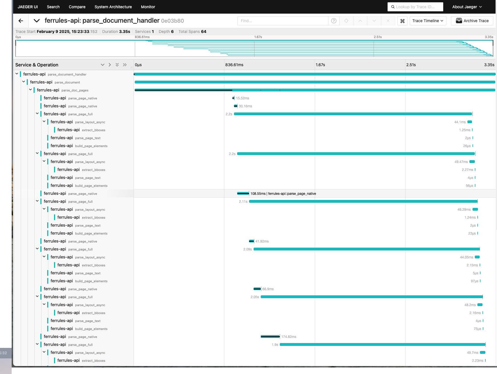

# Ferrules API Documentation

## Overview

Ferrules API provides a HTTP interface to the document parsing capabilities of Ferrules. The API server is available through the `ferrules-api` binary.

## Server Configuration

The API server can be configured using the following options:

```sh
Options:
  --otlp-endpoint <OTLP_ENDPOINT>        OpenTelemetry collector endpoint [default: http://localhost:4317]
  --sentry-dsn <SENTRY_DSN>             Sentry DSN for error tracking
  --sentry-environment <SENTRY_ENVIRONMENT>  Sentry environment [default: dev]
  --listen-addr <LISTEN_ADDR>           API listen address [default: 0.0.0.0:3002]
  --sentry-debug                        Enable debug mode for Sentry
  --coreml                             Enable CoreML for layout inference
  --use-ane                            Enable Apple Neural Engine acceleration
  --trt                                Enable TensorRT for layout inference
  --cuda                               Enable CUDA for layout inference
  --device-id <DEVICE_ID>              CUDA device ID [default: 0]
  -j, --intra-threads <INTRA_THREADS>  Threads for parallel processing [default: 16]
  --inter-threads <INTER_THREADS>      Threads for parallel operations [default: 4]
  -O, --graph-opt-level <LEVEL>        Ort graph optimization level
```

## Environment Variables

The following environment variables can be used to configure the API server:

- `OTLP_ENDPOINT`: OpenTelemetry collector endpoint
- `SENTRY_DSN`: Sentry DSN for error tracking
- `SENTRY_ENVIRONMENT`: Sentry environment
- `API_LISTEN_ADDR`: API listen address
- `SENTRY_DEBUG`: Enable Sentry debug mode

## Performance Tuning

### Hardware Acceleration

- Use `--coreml` and `--use-ane` for Apple Silicon devices
- Use `--cuda` and `--device-id` for NVIDIA GPUs
- Use `--trt` for TensorRT acceleration

### Threading

- `--intra-threads`: Controls parallel processing within graph node of `ort`
- `--inter-threads`: Controls parallel execution **inside** the graph (not taking into account for now).

## API Endpoints

### Health Check

- **GET** `/health`
- Returns service health status
- Response:

```json
{
  "success": true,
  "data": "Service is healthy",
  "error": null
}
```

### Parse Document

- **POST** `/parse`
- Content-Type: `multipart/form-data`
- Body parameters:
  - `file`: PDF document (required)
  - `options`: JSON string with parsing options (optional)
    ```json
    {
      "page_range": "1-5", // Optional page range
      "_save_images": false // Whether to save extracted images
    }
    ```
- Size limit: 250MB

#### Response Format

```json
{
  "success": true,
  "data": {
    "id": "uuid",
    "pages": [...],
    "metadata": {...}
  },
  "error": null
}
```

## Examples

### Single File Processing

```python
import requests

def parse_document(file_path, page_range=None):
    url = "http://localhost:3002/parse"

    files = {
        'file': open(file_path, 'rb')
    }

    options = {}
    if page_range:
        options['page_range'] = page_range

    data = {
        'options': json.dumps(options)
    } if options else None

    response = requests.post(url, files=files, data=data)
    return response.json()

# Parse single document
result = parse_document('document.pdf', page_range='1-5')
```

### Parallel Processing

```python
import asyncio
import aiohttp

async def parse_document_async(session, file_path, page_range=None):
    url = "http://localhost:3002/parse"

    data = aiohttp.FormData()
    data.add_field('file',
                   open(file_path, 'rb'),
                   filename=os.path.basename(file_path))

    if page_range:
        data.add_field('options',
                      json.dumps({'page_range': page_range}))

    async with session.post(url, data=data) as response:
        return await response.json()

async def process_documents(file_paths):
    async with aiohttp.ClientSession() as session:
        tasks = [
            parse_document_async(session, path)
            for path in file_paths
        ]
        return await asyncio.gather(*tasks)

# Process multiple documents in parallel
file_paths = ['doc1.pdf', 'doc2.pdf', 'doc3.pdf']
results = asyncio.run(process_documents(file_paths))
```

## Monitoring

### OpenTelemetry Tracing

Ferrules API integrates with OpenTelemetry to provide detailed tracing of document processing operations. The traces can be visualized using Jaeger UI:



Key traced operations include:

- Document parsing
- Layout inference
- Text extraction
- Table detection
- Image extraction

Each trace contains:

- Operation duration
- CPU/Memory usage
- Document metadata
- Processing parameters
- Error information (if any)

### Metrics

The following metrics are available through OpenTelemetry:

- Request latency
- Document processing time
- Layout Model inference time
- Queue time waiting lengths

### Error Tracking

Sentry integration provides:

- Error capturing and grouping
- Stack traces
- Environment context
- Release tracking
- Performance monitoring

Configure Sentry using the `--sentry-dsn` flag or `SENTRY_DSN` environment variable.
