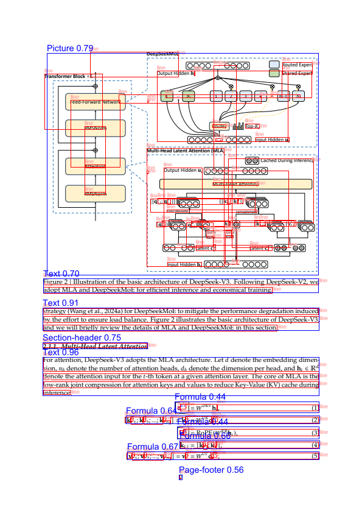
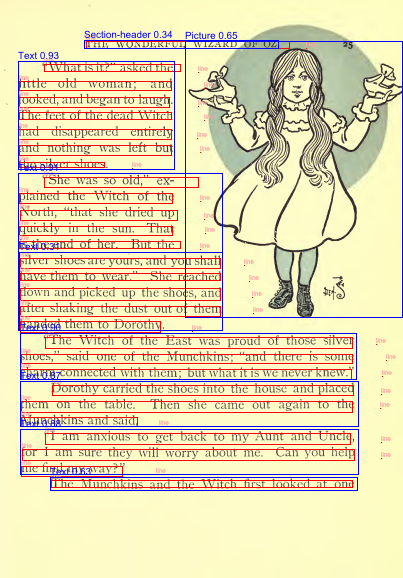

<div align="center">
<h1> Ferrules:  Modern, fast, document parser written in 🦀 </h1>
</div>

---

> 🚧 **Work in Progress**: Check out our [roadmap](./ROADMAP.md) for upcoming features and development plans.

Ferrules is an **opinionated high-performance document parsing library** designed to generate LLM-ready documents efficiently.
Unlike alternatives such as `unstructured` which are slow and Python-based, `ferrules` is written in Rust and aims to provide a seamless experience with robust deployment across various platforms.

| **NOTE** A ferrule is a corruption of Latin viriola on a pencil known as a Shoe, is any of a number of types of objects, generally used for fastening, joining, sealing, or reinforcement.

## Features

- **📄 PDF Parsing and Layout Extraction:**

  - Utilizes `pdfium2` to parse documents.
  - Supports OCR using Apple's Vision on macOS (using `objc2` Rust bindings and [`VNRecognizeTextRequest`](https://developer.apple.com/documentation/vision/vnrecognizetextrequest) functionality).
  - Extracts and analyzes **page layouts** with advanced preprocessing and postprocessing techniques.
  - Accelerate model inference on Apple Neural Engine (ANE)/GPU (using [`ort`](https://ort.pyke.io/) library).
  - Merges layout with PDF text lines for comprehensive document understanding.

- **🔄 Document Transformation:**

  - Groups captions, footers, and other elements intelligently.
  - Structures lists and merges blocks into cohesive sections.
  - Detects headings and titles using machine learning for logical document structuring.

- **🖨️ Rendering:** Provides HTML, Markdown, and JSON rendering options for versatile use cases.

- **⚡ High Performance & Easy Deployment:**

  - Built with **Rust** for maximum speed and efficiency
  - Zero-dependency deployment (no Python runtime required !)
  - Hardware-accelerated ML inference (Apple Neural Engine, GPU)
  - Designed for production environments with minimal setup

- **⚙️ Advanced Functionalities:** : Offers configurable inference parameters for optimized processing (COMING SOON)

- **🛠️ API and CLI:**

  - Provides both a CLI and API interface
  - Supports tracing

## Installation

Ferrules provides precompiled binaries for macOS, available for download from the [GitHub Releases](https://github.com/aminediro/ferrules/releases) page.

### macOS Installation

1. Download the latest `ferrules-macos` binary from the [releases](https://github.com/aminediro/ferrules/releases).

2. Make the binary executable:

   ```sh
   chmod +x ferrules-macos
   ```

3. Move the binary to a directory in your PATH, for example `/usr/local/bin`:

   ```sh
   sudo mv ferrules-macos /usr/local/bin/ferrules
   ```

4. Verify the installation:

   ```sh
   ferrules --version
   ```

### Linux Installation (COMING SOON)

Linux support with NVIDIA GPU acceleration will be available soon. Keep an eye out for updates on the [releases](https://github.com/aminediro/ferrules/releases) page.

> ⚠️ **Note:** Ensure that you have the necessary permissions to execute and move files to system directories.

Visit the [GitHub Releases](https://github.com/aminediro/ferrules/releases) page to find the latest version suitable for your operating system.

## Usage

Ferrules provides two ways to use the library:

### 1. Command Line Interface (CLI)

### Basic Usage

```sh
ferrules path/to/your.pdf
```

This will parse the PDF and save the results in the current directory:

```sh
ferrules file.pdf
[00:00:02] [########################################] Parsed document in 108ms
✓ Results saved in: ./file-results.json
```

### Debug Mode

To get detailed processing information and debug outputs:

```sh
ferrules path/to/your.pdf --debug
[00:00:02] [########################################] Parsed document in 257ms
ℹ Debug output saved in: /var/folders/x1/1fktcq215tl73kk60bllw9rc0000gn/T/ferrules-XXXX
✓ Results saved in: ./megatrends-results.json
```

Debug mode generates visual output showing the parsing results for each page:

<div align="center">
    
    
</div>

Each color represents different elements detected in the document:

- 🟦 Layout detection
- 🟩 OCR parsed lines
- 🟥 Pdfium parsed lines

### Available Options

```
Options:
  -r, --page-range <PAGE_RANGE>
          Specify pages to parse (e.g., '1-5' or '1' for single page)
      --output-dir <OUTPUT_DIR>
          Specify the directory to store parsing result [env: FERRULES_OUTPUT_DIR=]
      --save-images
          Specify the directory to store parsing result
      --layout-model-path <LAYOUT_MODEL_PATH>
          Specify the path to the layout model for document parsing [env: FERRULES_LAYOUT_MODEL_PATH=]
      --coreml
          Enable or disable the use of CoreML for layout inference
      --use-ane
          Enable or disable Apple Neural Engine acceleration (only applies when CoreML is enabled)
      --trt
          Enable or disable the use of TensorRT for layout inference
      --cuda
          Enable or disable the use of CUDA for layout inference
      --device-id <DEVICE_ID>
          CUDA device ID to use (0 for first GPU) [default: 0]
  -j, --intra-threads <INTRA_THREADS>
          Number of threads to use for parallel processing within operations [default: 2]
      --inter-threads <INTER_THREADS>
          Number of threads to use for executing operations in parallel [default: 1]
  -O, --graph-opt-level <GRAPH_OPT_LEVEL>
          Ort graph optimization level
      --debug
          Activate debug mode for detailed processing information [env: FERRULES_DEBUG=]
      --debug-dir <DEBUG_DIR>
          Specify the directory to store debug output files [env: FERRULES_DEBUG_PATH=]
  -h, --help
          Print help
  -V, --version
          Print version
```

You can also configure some options through environment variables:

- `FERRULES_OUTPUT_DIR`: Set the output directory
- `FERRULES_LAYOUT_MODEL_PATH`: Set the layout model path
- `FERRULES_DEBUG`: Enable debug mode
- `FERRULES_DEBUG_PATH`: Set the debug output directory

### 2. HTTP API Server

Ferrules also provides an HTTP API server for integration into existing systems. To start the API server:

```sh
ferrules-api
```

By default, the server listens on `0.0.0.0:3002`. For detailed API documentation, see [API.md](./API.md).

## Resources:

- Apple vision text detection:

  - https://github.com/straussmaximilian/ocrmac/blob/main/ocrmac/ocrmac.py
  - https://docs.rs/objc2-vision/latest/objc2_vision/index.html
  - https://developer.apple.com/documentation/vision/recognizing-text-in-images

- `ort` : https://ort.pyke.io/

## Credits

This project uses models from the [yolo-doclaynet repository](https://github.com/ppaanngggg/yolo-doclaynet). We are grateful to the contributors of that project.
