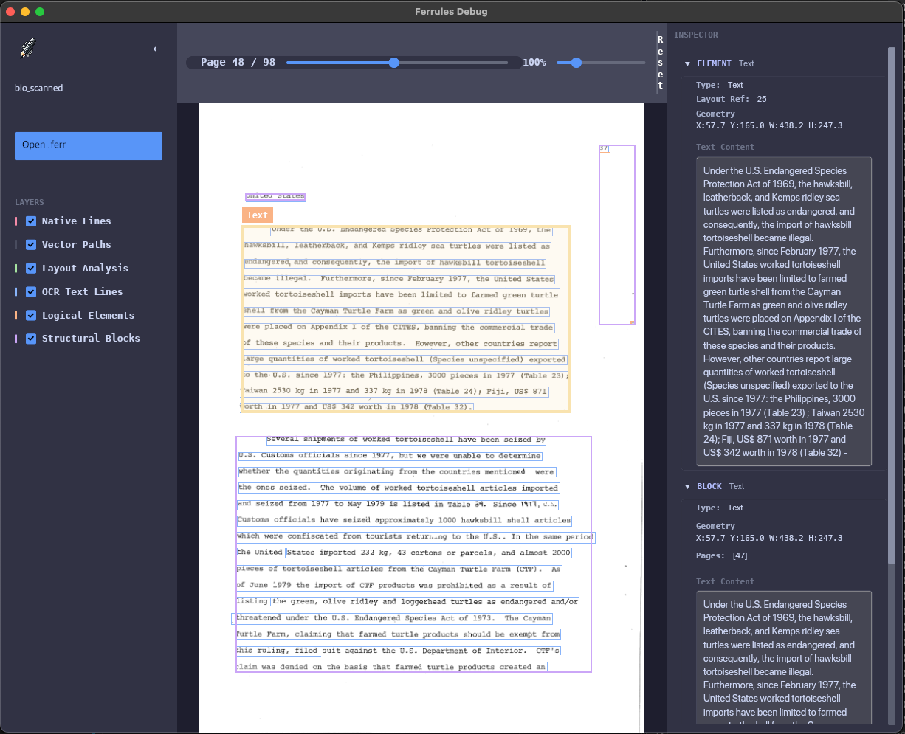
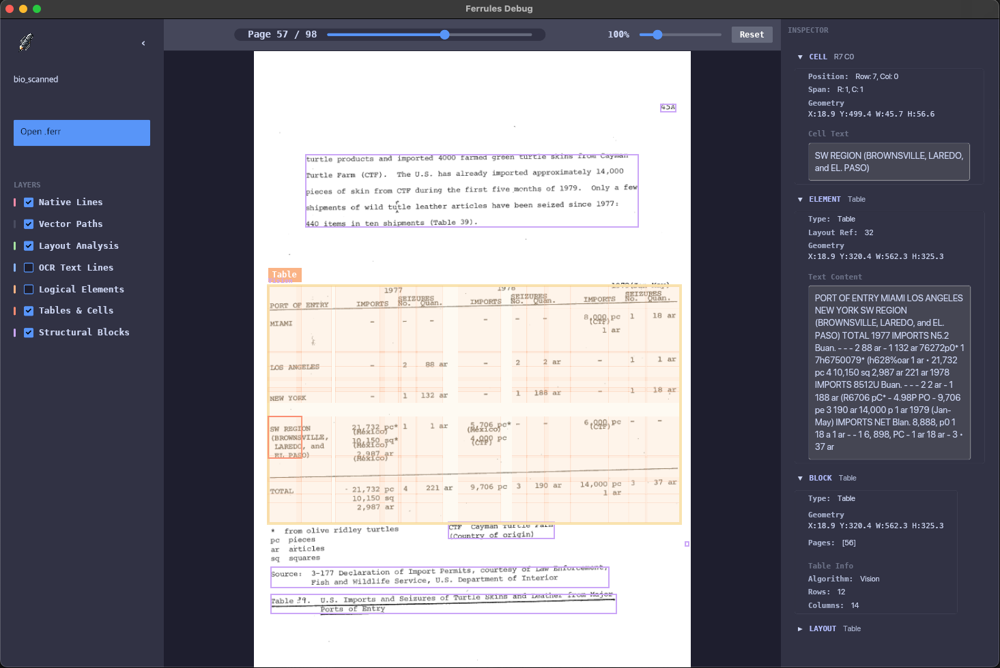

<div align="center">
<h1> Ferrules:  Modern, fast, document parser written in 🦀 </h1>
</div>

---

> 🚧 **Work in Progress**: Check out our [roadmap](./ROADMAP.md) for upcoming features and development plans.

Ferrules is an **opinionated high-performance document parsing library** designed to generate LLM-ready documents efficiently.
Unlike alternatives such as `unstructured` which are slow and Python-based, `ferrules` is written in Rust and aims to provide a seamless experience with robust deployment across various platforms.

| **NOTE** A ferrule is a corruption of Latin viriola on a pencil known as a Shoe, is any of a number of types of objects, generally used for fastening, joining, sealing, or reinforcement.

## Features

- **📄 PDF Parsing and Layout Extraction:**
    - Utilizes `pdfium2` to parse documents.
    - Supports OCR using Apple's Vision on macOS (using `objc2` Rust bindings and [`VNRecognizeTextRequest`](https://developer.apple.com/documentation/vision/vnrecognizetextrequest) functionality).
    - Extracts and analyzes **page layouts** with advanced preprocessing and postprocessing techniques.
    - Accelerate model inference on Apple Neural Engine (ANE)/GPU (using [`ort`](https://ort.pyke.io/) library).
    - Merges layout with PDF text lines for comprehensive document understanding.

- **📊 Advanced Table Parsing:**
    - Robust table structure recognition using three complementary algorithms.
    - Intelligent fallback heuristics to ensure high-accuracy extraction across different table styles.
    - Handles both bordered (Lattice) and borderless (Stream/Vision) tables.
    - Extracts spanning cells and preserves cell alignment.

- **🔄 Document Transformation:**
    - Groups captions, footers, and other elements intelligently.
    - Structures lists and merges blocks into cohesive sections.
    - Detects headings and titles using machine learning for logical document structuring.

- **🖨️ Rendering:** Provides HTML, Markdown, and JSON rendering options for versatile use cases.

- **⚡ High Performance & Easy Deployment:**
    - Built with **Rust** for maximum speed and efficiency
    - Zero-dependency deployment (no Python runtime required !)
    - Hardware-accelerated ML inference (Apple Neural Engine, GPU)
    - Designed for production environments with minimal setup

- **⚙️ Advanced Functionalities:** : Offers configurable inference parameters for optimized processing (COMING SOON)

- **🛠️ API and CLI:**
    - Provides both a CLI and API interface
    - Supports tracing

## Installation

Ferrules provides precompiled binaries for macOS, available for download from the [GitHub Releases](https://github.com/aminediro/ferrules/releases) page.

### macOS Installation

1. Download the latest `ferrules` binary from the [releases](https://github.com/aminediro/ferrules/releases).

2. Verify the installation:

    ```sh
    ferrules --version
    ```

### Linux Installation

Linux support with NVIDIA GPU acceleration will be available soon. Keep an eye out for updates on the [releases](https://github.com/aminediro/ferrules/releases) page.

> ⚠️ **Note:** Ensure that you have the necessary permissions to execute and move files to system directories.

Visit the [GitHub Releases](https://github.com/aminediro/ferrules/releases) page to find the latest version suitable for your operating system.

## Usage

Ferrules provides two ways to use the library:

### 1. Command Line Interface (CLI)

### Basic Usage

```sh
ferrules path/to/your.pdf
```

This will parse the PDF and save the results in the current directory:

```sh
ferrules file.pdf
[00:00:02] [########################################] Parsed document in 108ms
✓ Results saved in: ./file-results.json
```

### Debug Mode

To get detailed processing information and debug outputs:

```sh
ferrules path/to/your.pdf --debug
```

Running with `--debug` will generate:
1. Visual JSON results and cropped images (if enabled).
2. A `.ferr` debug archive containing all intermediate states (layout, OCR, native lines, tables).

### 🛠️ Visual Debugger (`ferrules-debug`)

`ferrules-debug` is a lightweight, cross-platform visualizer built with [Iced](https://iced.rs/). It allows you to inspect exactly how the engine interpreted your document.

<div align="center">

| Simple Layout Analysis | Complex Table Extraction |
|:---:|:---:|
|  |  |

</div>

<p align="center">
  <video src="https://github.com/user-attachments/assets/d3b13807-98ea-404d-9b93-75158f25bee9" width="100%" controls muted autoplay loop></video>
</p>


**How to use:**
1. Run the parser with the debug flag: `ferrules sample.pdf --debug`
2. Open the resulting `.ferr` file: `ferrules-debug --file path/to/sample.ferr`
3. Toggle layers (Layout, OCR, Tables, Blocks) to inspect the parsing logic.

### 🧠 Table Parsing Algorithms

Ferrules uses a tiered approach to table extraction:

1.  **Lattice**: Detects tables with explicit borders by analyzing PDF vector paths. It's the most accurate for traditional tables.
2.  **Stream**: Used for tables without visible borders. It analyzes text alignment and whitespace gaps to reconstruct the grid.
3.  **Vision (Table Transformer)**: A deep learning fallback using the Table Transformer model. It is triggered when the previous methods yield "suspicious" results (e.g., low cell density in a large area).

**Heuristics**: The engine automatically sequences these algorithms. If a `Stream` result appears incomplete or messy, it triggers `Vision` to verify and improve the structure recognition.

### Available Options

```
Options:
  -r, --page-range <PAGE_RANGE>
          Specify pages to parse (e.g., '1-5' or '1' for single page)
      --output-dir <OUTPUT_DIR>
          Specify the directory to store parsing result [env: FERRULES_OUTPUT_DIR=]
      --save-images
          Specify the directory to store parsing result
      --layout-model-path <LAYOUT_MODEL_PATH>
          Specify the path to the layout model for document parsing [env: FERRULES_LAYOUT_MODEL_PATH=]
      --coreml
          Enable or disable the use of CoreML for layout inference
      --use-ane
          Enable or disable Apple Neural Engine acceleration (only applies when CoreML is enabled)
      --trt
          Enable or disable the use of TensorRT for layout inference
      --cuda
          Enable or disable the use of CUDA for layout inference
      --device-id <DEVICE_ID>
          CUDA device ID to use (0 for first GPU) [default: 0]
  -j, --intra-threads <INTRA_THREADS>
          Number of threads to use for parallel processing within operations [default: 2]
      --inter-threads <INTER_THREADS>
          Number of threads to use for executing operations in parallel [default: 1]
  -O, --graph-opt-level <GRAPH_OPT_LEVEL>
          Ort graph optimization level
      --debug
          Activate debug mode for detailed processing information [env: FERRULES_DEBUG=]
      --debug-dir <DEBUG_DIR>
          Specify the directory to store debug output files [env: FERRULES_DEBUG_PATH=]
  -h, --help
          Print help
  -V, --version
          Print version
```

You can also configure some options through environment variables:

- `FERRULES_OUTPUT_DIR`: Set the output directory
- `FERRULES_LAYOUT_MODEL_PATH`: Set the layout model path
- `FERRULES_DEBUG`: Enable debug mode
- `FERRULES_DEBUG_PATH`: Set the debug output directory

### 2. HTTP API Server

Ferrules also provides an HTTP API server for integration into existing systems.

#### Running locally

To start the API server locally:

```sh
ferrules-api
```

#### Running with Docker (NVIDIA GPU)

For systems with NVIDIA GPU support, you can run the API server using Docker:

```sh
docker run -p 3002:3002 --gpus all aminediro/ferrules-api-gpu
```

By default, the server listens on `0.0.0.0:3002`. For detailed API documentation and additional running options, see [API.md](./API.md).

## Font Correction System

Ferrules includes a **unified correction engine** that dynamically analyzes PDF fonts at runtime, requiring no config files or hardcoded patterns.

### Correction Pipeline

1. **Universal Font Corrector** (`ferrules-core/src/font_analysis/universal_corrector.rs`) — Analyzes PDF fonts via glyph names, ToUnicode CMaps, and Adobe Glyph List. Generates mappings for mathematical Unicode ranges (U+1D400-U+1D7FF). Detects mathematical fonts (CMMI, CMSY, CMEX, CambriaMath, etc.)
2. **Character Corrector** (`ferrules-core/src/correction/character.rs`) — Fixes UTF-8 corruption and removes control characters
3. **Dictionary Corrector** (`ferrules-core/src/font_analysis/dictionary.rs`) — Validates words using a 52K+ embedded English dictionary. Skips mid-word parentheses (extraction boundary artifacts)

**Key files:**
- `ferrules-core/src/font_analysis/adobe_glyph_list.rs` — Standard glyph name to Unicode mappings
- `ferrules-core/src/correction/engine.rs` — Orchestrates all correction strategies
- `ferrules-core/src/correction/dictionaries/` — Embedded word lists

**Performance:** ~2.7s for a 7-page paper, <50MB overhead, linear scaling.

### Known Limitations

- Cannot correct fonts with entirely random character mappings
- Some PDFs lack sufficient glyph information for correction

## Mathematical Content Detection

Ferrules flags text blocks and list items containing math with `has_math: true` in JSON output, enabling downstream LLM-based text formula translation.

### Detection Pipeline

`CharSpan` → `Element` → `TextBlock` (OR propagation at each level)

- **CharSpan** (`entities.rs`): `has_math_font` set when a character comes from a mathematical font or is a mathematical Unicode symbol (U+1D400-U+1D7FF, plus curated operators like ∀, ∑, ∫, ≠, ⊂).
- **Element** (`entities.rs`): `has_math` set if any span in any line has `has_math_font`.
- **TextBlock** (`blocks.rs`, `merge.rs`): `has_math` propagates through merges. Serialized only when true (`skip_serializing_if`).
- **ListItem** (`blocks.rs`, `merge.rs`): `has_math` propagates from element to each list item.

### TeX CMMI/CMSY Font Encoding

TeX math fonts encode Greek letters as control characters (0x00-0x21). `tex_math_encoding()` in `entities.rs` maps these to Unicode Greek (e.g., 0x0F → ε, 0x12 → θ).

CMMI position 0x20 maps to ψ (psi), but 0x20 is also ASCII space, so inter-glyph spaces in CMMI fonts become literal ψ characters. Downstream processing handles this with `replace_cmmi_psi_spaces()`.

## Subscript/Superscript Detection

**Location:** `ferrules-core/src/modtext/script_notation.rs`

Multi-layered composite scoring (99.89% accuracy):
- Vertical offset from baseline (75% weight)
- Font size shrinkage (25% weight)

**Dual-layer processing:**
1. Sequential analysis — character-by-character for simple text
2. Clustering analysis — Y-position grouping for complex math notation

**Features:**
- Local mode-based baseline using ±3pt Y-range
- Footnote reference detection: emits `<foot>` tags (vs `<sup>` for math superscripts)
- Radical sign (√) excluded from script detection
- Works with corrupted fonts and inconsistent baselines

### Footnote References (`<foot>` tag)

Script notation distinguishes footnote references from math superscripts:
- `<foot>1</foot>` — definitively a footnote (stripped unconditionally downstream)
- `<sup>2</sup>` — math superscript (downstream uses heuristics, skips `has_math` blocks)

## JSON Output Format

### Text Block Fields

| Field | Description |
|-------|-------------|
| `text` | Processed text content |
| `fertext` | Original ferrules text (preserved for alignment) |
| `has_math` | Mathematical content flag (only present when true) |
| `char_spans` | Character bounding boxes for sentence highlighting |
| `sentence_ends` | Sentence boundary indices |

### Block Types

TextBlock, Title, ListBlock, TableBlock, Caption, Formula, Footer, Header

### Formula Block Handling

Formula blocks (detected by the ONNX layout model) receive raw text plus cropped PNG images (`formula_{block_id}.png`). Text blocks receive full processing including hyphen removal, font corrections, and script detection.

## Troubleshooting

**API server not responding (macOS):**
Start manually: `cd ferrules && cargo run --release --bin ferrules-api`

**Slow processing:**
Processing time scales linearly with document size. Debug with `RUST_LOG=debug` and `FERRULES_DEBUG_OUTPUT=file`.

**Incorrect font corrections:**
Enable debug output (`FERRULES_DEBUG_OUTPUT=file`) to examine font analysis details. Debug files are saved to `/tmp/ferrules-debug/{doc_name}-debug.txt`.

## Resources:

- Apple vision text detection:
    - https://github.com/straussmaximilian/ocrmac/blob/main/ocrmac/ocrmac.py
    - https://docs.rs/objc2-vision/latest/objc2_vision/index.html
    - https://developer.apple.com/documentation/vision/recognizing-text-in-images

- `ort` : https://ort.pyke.io/

## Credits

This project uses models from the [yolo-doclaynet repository](https://github.com/ppaanngggg/yolo-doclaynet). We are grateful to the contributors of that project.
